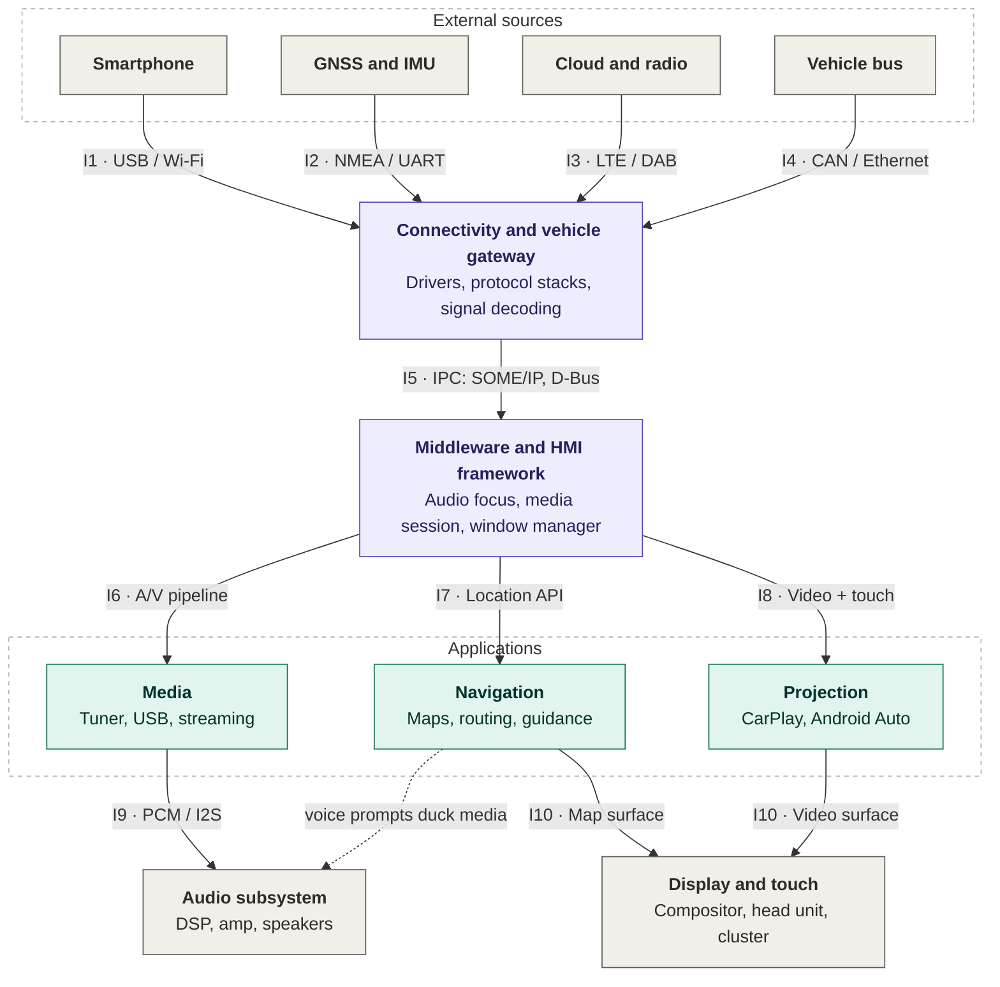

# Wipro_project_module_6
# IVI System: Conceptual Architecture

Layered architecture of an In-Vehicle Infotainment (IVI) system that integrates **media**, **navigation** and **smartphone projection** (Apple CarPlay and Android Auto). Data flows top to bottom. Interface IDs `I1` to `I10` are labelled on the arrows and described in the table below.

Full write-up: [`IVI_Architecture_Report.pdf`](IVI_Architecture_Report.pdf)

## Architecture diagram

**Legend:** gray = external I/O, purple = platform layers, teal = applications. The dotted arrow is the navigation voice-prompt path to the audio subsystem, handled through audio focus in the middleware.

## Interface annotation

| ID | Between | Interface | Data |
|---|---|---|---|
| I1 | Smartphone to Gateway | USB (AOA/iAP2), Wi-Fi, Bluetooth | Projected video, audio, touch, calls |
| I2 | GNSS and IMU to Gateway | NMEA over UART | Position, speed, heading |
| I3 | Cloud and radio to Gateway | LTE modem, DAB/FM tuner | Streams, traffic, map tiles |
| I4 | Vehicle bus to Gateway | CAN, LIN, Automotive Ethernet | Speed, gear, ignition, door state |
| I5 | Gateway to Middleware | SOME/IP, D-Bus | Typed signals and events |
| I6 | Middleware to Media | Media session API, A/V pipeline | Decoded audio and video |
| I7 | Middleware to Navigation | Location API | Position and vehicle state |
| I8 | Middleware to Projection | Video and touch channel | Phone stream and touch events |
| I9 | Media to Audio | PCM over I2S/TDM | Audio samples |
| I10 | Navigation, Projection to Display | Compositor surfaces | Rendered frames |

## Data flow scenarios

1. **Media playback:** Sources → I1 or I3 → Gateway → I5 → Middleware → I6 → Media → I9 → Audio.
2. **Navigation with voice guidance:** GNSS and IMU → I2 → Gateway → I5 → Middleware → I7 → Navigation → I10 → Display. Prompts request audio focus and duck the media volume.
3. **Phone projection:** Smartphone → I1 → Gateway → I5 → Middleware → I8 → Projection → I10 → Display. Touch events return upward to the phone. Reverse gear on I4 pre-empts the display with the camera view.

## Arbitration rules (middleware layer)

- **Audio focus:** safety alerts, then phone call, then navigation prompt, then media. Lower-priority streams are ducked or paused.
- **Display:** the window manager owns composition. Applications draw only to their own surfaces.
- **Input:** touch and steering-wheel events go to the foreground app. Hard keys (Home, Voice) are always handled by the middleware.

## Scope

Conceptual design only. Timing budgets, functional-safety partitioning (for example ISO 26262) and a threat model are not covered. See sections 7 and 8 of the report.
